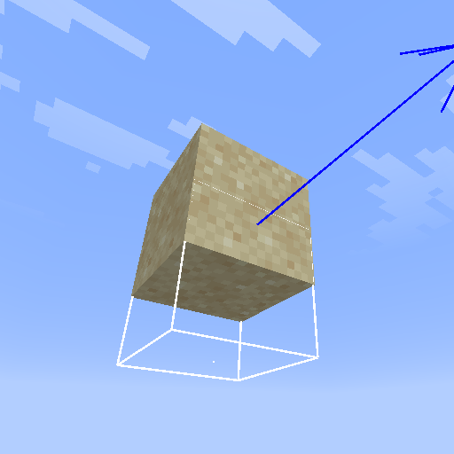

# Extrapolate

Extrapolate is a Minecraft mod which extrapolates entity position instead of interpolates to get a more accurate entity pos despite server delay

## Config
- Enable mod
- Weight of extrapolation (explained below) 
- disableSmooth: disable extrapolation and interpolation, only update the position each tick, which cause entity to jitter if ur having fps >20
- onlyHitbox: only extrapolates hitbox for technical use, keeping normal entity rendering unchanged with vanilla interpolation
- renderPhysics: experimental: uses the same position data from hitbox to render entity, to avoid jittering caused by fluctuating positional packet arrival timings 
- debug: use it if ur a dev:)

## How does it work?
Instead of interpolating the position of entities, which mean smoothen the motion of entities by calculating inbetween position between each tick (20/s), but it adds up to 50ms delay on top of ping

This mod improves this by predicting the position of entities based on the current and last position, making entity position more up to date. How much does it predict/ weight is configurable.

Small values (<0.4) of weight is recommended as it can improve the latency without causing the entity to jitter when their velocity changes.
